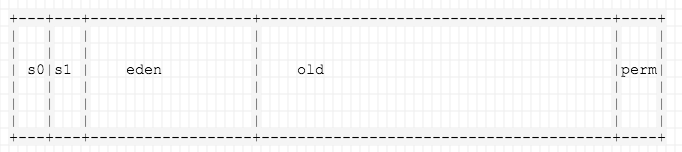
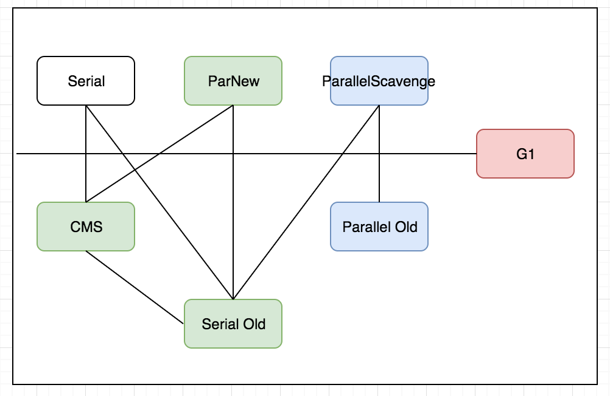

### heap

### 判断对象是否存活

1. 引用计数法 Reference Counting

2. 可达性分析法

   通过GC Roots向下搜索，搜索不到的都可以回收。

   + GC Roots
     + 虚拟机栈（栈帧中的本地变量表）中引用的对象
     + 方法区中类静态属性引用的对象
     + 方法区中常量引用的对象
     + 本地方法栈中JNI引用的对象。

### 垃圾回收算法

| 算法                                 | 流程                                                         | 图示 | 优点       | 缺点                                                  |
| ------------------------------------ | ------------------------------------------------------------ | ---- | ---------- | ----------------------------------------------------- |
| 标记-清除算法 Mark-Sweep             | 1. 标记无用对象 2. 清除                                 |      |            | 1. 两个过程效率都不高 2.空间问题，会产生内存碎片 |
| 复制算法 Copying                     | 将内存分为相等的两块，当一块用完，将存活对象复制到另一块，然后将已使用的一次性清理 |      | 速度快     | 空间利用率低                                          |
| 标记-整理算法 Mark-Compact           | 1.标记无用对象 2.让存活对象向一端移动，最后清理掉边界外的内存 |      | 无内存碎片 | 速度慢                                                |
| 分代收集算法 Generational Collection | 根据对象存活周期将内存分为几块，每块采取不同的算法           |      |            |                                                       |

1. 什么是内存担保？

   如果另一块Survivor没有足够的空间存放上一次新生代收集下来的存活对象时，这些对象将直接通过分配担保机制进入老年代。

### 垃圾收集器

+ Serial,ParNew,ParallelScavenge 复制算法
+ Serial old 标记整理算法