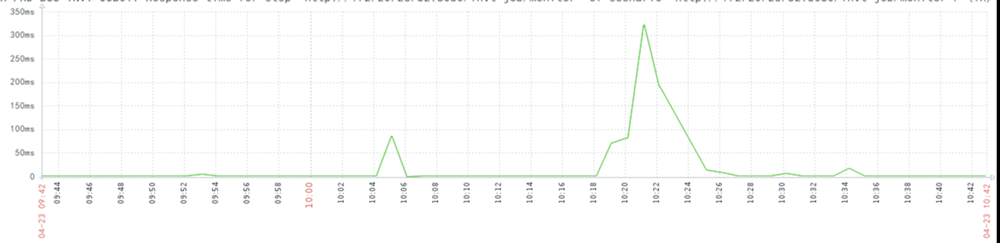
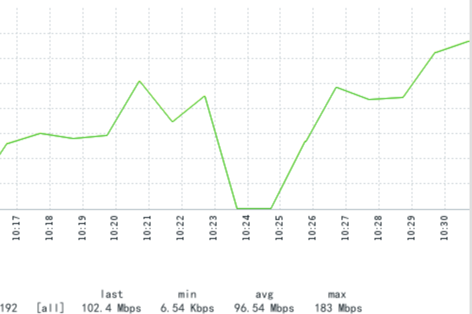
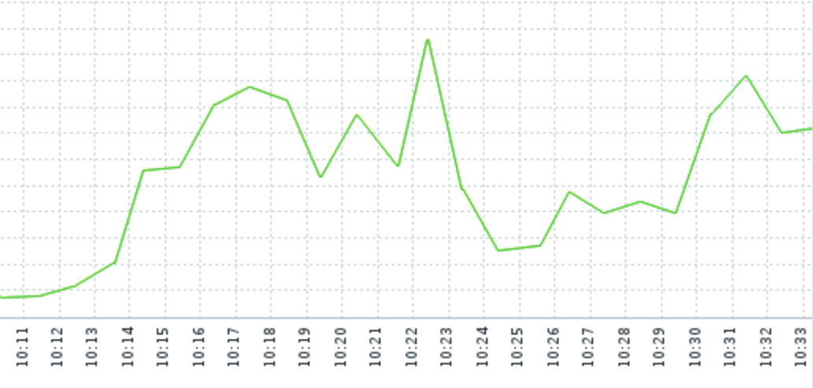
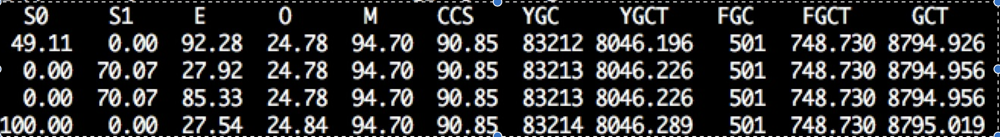

### 发现

半个月前发现，邮件报警，线上的tomcat一直在报监控接口超时，这个监控接口就是返回个hello world。这也能超时，真是奇了怪了。。。这个报警，大约几个小时来一次。业务没受到影响，这是个job机器，稍微慢点，也没啥问题，但是这个邮件确实烦人。所以还是想办法搞搞吧。


### 线上监控

1. 监控接口请求耗时监控

   

   一个大尖刺 😄

2. 网络监控

   

   这是完全没流量啊

3. cpu监控

   

   呦，还活着！！！

4. jstat

   


### 推断

从上面三个可以看出，机器没死，活着呢，网络停止了，估计jvm在gc（最后证实确实如此）。


### 抓gc


看一下原始的jvm参数（这个参数不是我配的😂）：

```
-XX:+UseCompressedOops -Xms7G -Xmx7G -XX:MetaspaceSize=64M -XX:+MaxMetaspaceSize=384M -Xloggc:path/log.log -verbose:gc  -XX:HeapDumpPath=/tmp -XX:+PrintGCDateStamps -XX:+PrintGCDetails -XX:+UseConcMarkSweepGC -XX:+UseCMSCompactAtFullCollection -XX:+CMSClassUnloadingEnabled -XX:ParallelGCThreads=4 -XX:ConcGCThreads=2 -XX:+HeapDumpOnOutOfMemoryError -XX:SurvivorRatio=26 -XX:+CMSParallelRemarkEnabled -XX:CMSInitiatingOccupancyFraction=80
```

首先，我需要看一下gc log，结果运维找不到日志，尴尬，相对路径，日志就没输出。第二，我要看一下fgc前后的堆变化情况，然后就加了下面的参数：

-XX:+HeapDumpBeforeFullGC -XX:+HeadDumpAfterFullGC

这俩东西就一起搞到线上去了。

然后。。。等待问题复现。

抓到了，看gclog！

```
2018-04-25T09:58:55.273+0800: 39018.975: [GC (Allocation Failure) 39018.976: [ParNew (promotion failed): 328576K->328576K(328576K), 0.2897109 secs]39019.266: [CMS2018-04-25T09:59:37.021+0800: 39060.736: [CMS-concurrent-sweep: 61.437/80.407 secs] [Times: user=85.18 sys=9.30, real=80.42 secs]
 (concurrent mode failure): 5754419K->709193K(6999296K), 93.9618683 secs] 6066058K->709193K(7327872K), [Metaspace: 125046K->125046K(1167360K)], 94.2613781 secs] [Times: user=8.22 sys=3.47, real=94.26 secs]
```

看到这里，就发现问题不对劲了，concurrent mode failure，real 80.42, 94.26。

其实在这个阶段，我没仔细算gc前后的heap大小，又去看了一下heap dump，dump也没看出来啥，但是，fgc前后的文件大小差距就大了，一个6.5g，一个600m。这个提醒我去看一下gc log。

young大小：320M？

看一下gc log中的初始化参数吧，找到gc log的最开头位置：

```
Memory: 4k page, physical 8010824k(7578720k free), swap 2097148k(1996844k free)
CommandLine flags: -XX:+CMSClassUnloadingEnabled -XX:CMSInitiatingOccupancyFraction=80 -XX:+CMSParallelRemarkEnabled -XX:ConcGCThreads=2 -XX:+HeapDumpOnOutOfMemoryError -XX:HeapDumpPath=/tmp/ -XX:InitialHeapSize=7516192768 -XX:+ManagementServer -XX:MaxHeapSize=7516192768 -XX:MaxMetaspaceSize=402653184 -XX:MaxNewSize=348966912 -XX:MetaspaceSize=67108864 -XX:NewSize=348966912 -XX:OldPLABSize=16 -XX:OldSize=697933824 -XX:ParallelGCThreads=4 -XX:+PrintGC -XX:+PrintGCDateStamps -XX:+PrintGCDetails -XX:+PrintGCTimeStamps -XX:SurvivorRatio=26 -XX:+UseCMSCompactAtFullCollection -XX:+UseCompressedClassPointers -XX:+UseCompressedOops -XX:+UseConcMarkSweepGC -XX:+UseParNewGC
2018-04-24T23:08:44.044+0800: 7.746: [GC (Allocation Failure) 7.746: [ParNew: 316416K->12160K(328576K), 0.0890565 secs] 316416K->24149K(7327872K), 0.0891831 secs] [Times: user=0.15 sys=0.01, real=0.09 secs]
2018-04-24T23:08:48.077+0800: 11.778: [GC (Allocation Failure) 11.778: [ParNew: 328576K->12159K(328576K), 0.0597998 secs] 340565K->48432K(7327872K), 0.0598772 secs] [Times: user=0.14 sys=0.01, real=0.06 secs]
2018-04-24T23:08:50.000+0800: 13.702: [GC (Allocation Failure) 13.702: [ParNew: 328575K->12160K(328576K), 0.0672809 secs] 364848K->69694K(7327872K), 0.0673553 secs] [Times: user=0.23 sys=0.01, real=0.07 secs]
2018-04-24T23:08:50.742+0800: 14.444: [GC (Allocation Failure) 14.444: [ParNew: 328576K->12160K(328576K), 0.0572250 secs] 386110K->101739K(7327872K), 0.0572988 secs] [Times: user=0.13 sys=0.00, real=0.06 secs]
```

1. 启动参数：NewSize，MaxNewSize 340788K **这么大的堆，这么小的新生代？**
2. gc 日志：

[ParNew: 328576K->12160K(328576K)  一个survivor区占用12160K，328576K=1个survivor+eden，survivor:eden=2:26 (12160*2):(328576-12160)=2:26  **-XX:SurvivorRatio=26**不理解这个参数为何要配这么多

3. -XX:CMSInitiatingOccupancyFraction=80 

   配置了启动的时机，但是没有配置-XX:+UseCMSInitiatingOccupancyOnly，导致这个配置成为摆设。

4. gc log中发现了System.gc

   那就把这个加上：-XX:+DisableExplicitGC，忽略系统的gc调用。


最后的参数：

```
-Xms7G -Xmx7G -Xmn3G 
-XX:MetaspaceSize=64M 
-XX:MaxMetaspaceSize=384M 
-Xloggc:xxx 
-verbose:gc 
-XX:+PrintGCDateStamps 
-XX:+PrintGCDetails 
-XX:+UseConcMarkSweepGC 
-XX:+UseCMSCompactAtFullCollection 
-XX:CMSInitiatingOccupancyFraction=75
-XX:+UseCMSInitiatingOccupancyOnly 
-XX:+CMSClassUnloadingEnabled 
-XX:+CMSParallelRemarkEnabled
-XX:ParallelGCThreads=4 
-XX:ConcGCThreads=2 
-XX:+HeapDumpOnOutOfMemoryError 
-XX:HeapDumpPath=/tmp/ 
-XX:+DisableExplicitGC 
```


